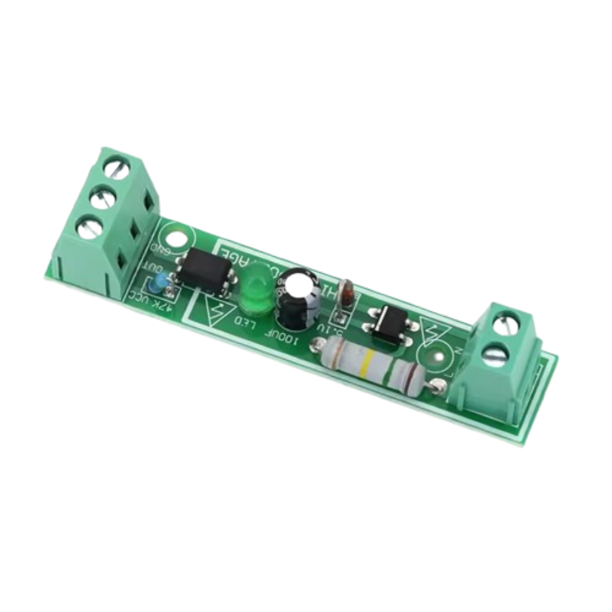
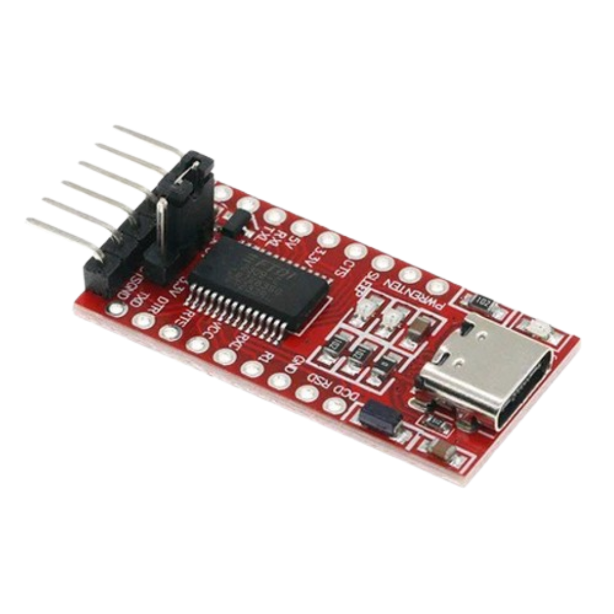

# Grid power

Home Assistant custom integration for detecting mains presence with an isolated AC detector and an FT232 USB-UART adapter.

The integration reads the FT232 modem-control input directly with Linux `TIOCMGET` and monitors `TIOCM_CTS`.

### How it works

The optocoupler's low-voltage `OUT` signal is connected to the FT232's `CTS` input. Home Assistant asks the Linux kernel for the current CTS modem-control bit using `TIOCMGET`. The integration interprets that bit as mains present or mains absent and polls it at the configured interval.

This is a hardware-status reading, not serial communication: no bytes are received through the FT232 `RX` path, and no serial data format or baud rate is involved.

## Safety

This project interfaces with mains voltage. Use an appropriately rated, enclosed, certified isolation module and follow local electrical regulations. Disconnect power before wiring. Keep the mains and low-voltage sides physically separated. The author is not responsible for damage, injury, or incorrect outage detection.

## Hardware

The following detector board is required:

- **1-Bit AC 220V Optocoupler Isolation Module Voltage Detect Board**

You also need an FT232 USB-UART adapter with an exposed CTS input. The detector board provides the isolation between the mains side and the FT232 low-voltage side.

### Hardware used



*1-Bit AC 220V Optocoupler Isolation Module Voltage Detect Board*



*FT232 USB-UART adapter with CTS exposed*

The low-voltage connections are:

| AC detector | FT232 adapter |
| --- | --- |
| VCC | 3.3 V or 5 V supported by the detector |
| GND | GND |
| OUT | CTS |

The tested setup uses an FT232BL adapter and `/dev/ttyUSB1` on Home Assistant OS. Other FT232 boards and device paths may work, but must be tested with the specific hardware.

## Installation with HACS as a custom repository

This integration is intentionally distributed as a custom HACS repository and is not part of the official HACS store.

1. Make sure this repository is available on GitHub.
2. Open **HACS → Integrations** in Home Assistant.
3. Open the menu and select **Custom repositories**.
4. Enter the GitHub repository URL and choose **Integration**.
5. Add the repository and download **Grid power**.
6. Restart Home Assistant.
7. Open **Settings → Devices & services → Add integration**.
8. Search for **Grid power** and open it.

## Manual installation

Copy the `custom_components/grid_power` directory into the Home Assistant configuration directory:

```text
/config/custom_components/grid_power/
```

Restart Home Assistant, then add **Grid power** from **Settings → Devices & services**.

## Configuration

The setup form contains:

- **Serial device** — for example `/dev/ttyUSB1`.
- **Poll interval** — defaults to 1 second.
- **Invert CTS state** — enable this if the detector's logic level is opposite to the desired mains state.

The integration creates a `binary_sensor` with device class `power`. The entity is normally named `Grid power` and reports `on` when mains power is present.

The USB device must be accessible to the Home Assistant Core container. A successful test from the Terminal & SSH add-on alone does not prove that Core can access the device, because the add-on and Core run in separate containers.

## Troubleshooting

- **The device cannot be opened:** confirm the adapter is connected, verify the path in the integration options, and check that Home Assistant Core can access the device.
- **The entity is unavailable:** check Home Assistant logs for the exact device path and permission error.
- **The state is reversed:** enable **Invert CTS state** in the integration options.
- **The device path changes after reboot:** use a stable serial-by-ID path if it is visible to Home Assistant Core, or update the integration's device option.
- **The integration is missing from Add integration:** reload the Home Assistant page or clear the browser cache after installing a custom integration.

## Development and publishing

This repository intentionally contains one integration only:

```text
custom_components/grid_power/
├── __init__.py
├── binary_sensor.py
├── config_flow.py
├── const.py
├── coordinator.py
├── device.py
├── manifest.json
├── strings.json
└── translations/en.json
```
